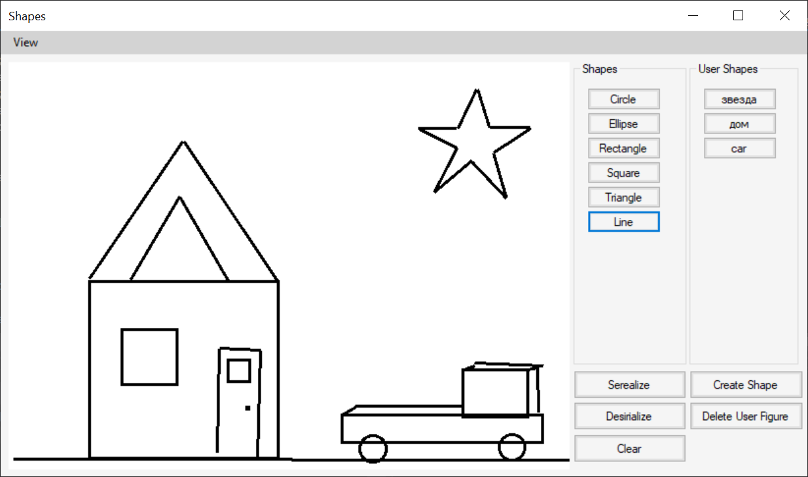

# drawing-shapes

Object-oriented programming labs

## Screenshot

## Tasks

#### 1. "Familiarization with OOP concepts: inheritance and type polymorphism (virtual methods)"

Construct a class hierarchy for displaying graphic figures: line, rectangle, ellipse, etc. - at least 6 figures. 
Distribute classes by modules. Create a list of shapes as a separate class. Add all figures to the list in the main program module, and then run drawing shapes from the list.
Complete task in C++, `C#` or Java. Use any suitable graphics library for drawing.
  
#### 2.  "Graphics editor"

Extend the example with figures so that shapes can be created at the user interface level. There are several ways: `input coordinates using the mouse`,
dialog input of values, input in the scripting language. The student can choose any input method. Creating an object must be done so that adding a new class to the system
did not require modification of the existing code. The resulting program should looks like a primitive graphic editor.
> **Note:** you can not select a figure type with *case*, *switch* and multiple *if*. Figure classes had not to contain drawing methods.
The project should be developed with using version control system Git.

#### 3. "Object serialization"

Select the subject area and build a class hierarchy. The hierarchy should contain at least 6 classes. 
Implement serialization and deserialization of objects from the received class hierarchy to and from a file, the serialization format is determined by the individual variant.

 | Variant| Format|
 | ------ |:-----:|
 |    1   | XML   |
 |    2   | Binary|
 |    3   | Text  |
 |    4   | `JSON`  |
 |    5   | BSON  |
 
 The variant number can be received according to formula: `(student's number in a group MOD variant count) + 1.`
 
 In the user interface you need to implement the following functions:
 * ability to change figure properties
 * add/remove objects to/from the list
 * serialization and deserialization the object list
 > **Note:** Adding new classes to the hierarchy should not require the existing code rewriting. Also you can not use *case*, *switch*, multiple *if* and *reflection*.
 The project should be developed with using version control system Git. Сomments language: English

#### 4. "Plugins" 

Based on the 2nd and the 3rd tasks expand the hierarchy with new classes by using a dynamic loading of module. New modules should add and enlarge the program functionality. A new functions/modules adding shouldnt require code changes.
The project should be developed with using version control system Git. Сomments language: English
 
#### 5. "Configuration properties" 

Expand the project with ability to config the program parametres. Add ability to change and save config.
A config should be read from XML and saved into XML. Make a XML-doc structure by yourself. Add exception handlers.

#### 6. "User shapes" 
Expand the project with ability to create user shapes based on another shapes.
